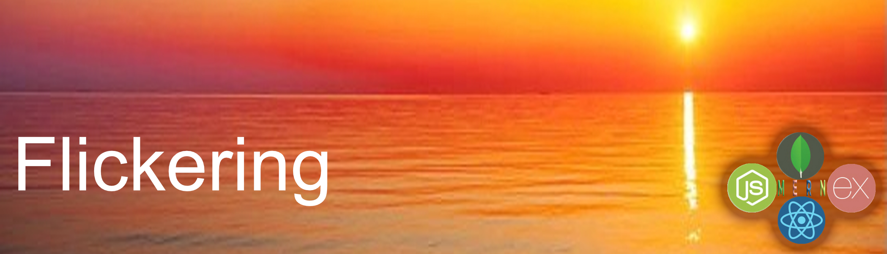

[](https://flickering.herokuapp.com)  [](https://github.com/Mark33Mark/flickering)  

# USYD-FSF Unit 23 Project 3  
 
## MERN: Flickering

### Table of Contents  
  
   1. [Project Description](#1-description)
   2. [Application Features](#2-features)
   3. [Installation](#3-installation)
   4. [Usage](#4-usage)
   5. [Credits](#5-credits)
   6. [License](#6-license)
   7. [Repository Status](#7-github-repo-status)
   8. [Contribute](#8-how-to-contribute)
   9. [Tests](#9-tests)
   10. [Checklist](#10-checklist)

---

### 1. Description  

**What is this project?**  

*  An emotion tracking application developed using the MERN stack.
   
   [Live application:  flickering.herokuapp.com](https://flickering.herokuapp.com)  

**Why this project?**  

*  

**What problem does this project solve?**  

* .  

**Lessons learnt?**  

*  

---

### 2. Features  


---

### 3. Installation

You are welcome to download the source code from [my Github repository](https://github.com/Mark33Mark/flickering)  

Once downloaded, you will need to install the dependencies with the following command in your terminal:  

```npm install```  


To run the application, type in the command line:

```npm start develop```  

Enjoy.  

---

### 4. Usage  

The code can be downloaded from [my Github repository](https://github.com/Mark33Mark/flickering) for all assets created for the project.  

You can modify the code as you need.

---

### 5. Credits  

*  React online documentation,
*  Stack Overflow forums.  
*  https://www.apollographql.com/blog/graphql/basics/graphql-vs-rest/
---

### 6. License  

 The works in this repository are subject to:  

[](doc/LICENSE.md)

---

### 7. Github repo status  


---

### 8. How to Contribute  

 If you would like to contribute, please comply with the Contributor Covenant Code of Conduct:  

[](doc/code_of_conduct.md)

---

### 9. Tests  

* No unit tests have been written for this application.  

---

### 10. Checklist  

 All actions not checked are still to be completed:  

[x]  This application satisfies the following acceptance criteria:  
   *   A

[x]  Application has an Apollo Server, using GraphQL queries and mutations to fetch and modify data, replacing the existing RESTful API.  
[x]  Use an Apollo Server and apply it to the Express.js server as middleware.  
[x]  Include schema settings for resolvers and typeDefs as outlined in the homework instructions.  
[x]  Modify the existing authentication middleware to work in the context of a GraphQL API.  
[x]  Use an Apollo Provider so that the application can communicates with the Apollo Server.  
[x]  Application is deployed to Heroku [flickering.herokuapp.com](https://flickering.herokuapp.com).  
[x]  Application loads with no errors.  
[x]  User experience is intuitive and easy to navigate.  
[x]  User interface style is clean and polished.  
[x]  Application resembles the mock-up functionality provided in the homework instructions.  
[x]  GitHub repository contains application code.
[x]  Application is deployed to GitHub Pages: [Github location: https://github.com/Mark33Mark/flickering](https://github.com/Mark33Mark/flickering)  
[x]  Application loads with no errors.  
[x]  Github repository contains application code: [Github location: https://github.com/Mark33Mark/flickering](https://github.com/Mark33Mark/flickering)  
[x]  Repository has a unique name.  
[x]  Repository follows best practices for file structure and naming conventions.  
[x]  Repository follows best practices for class/id naming conventions, indentation, quality comments, etc.  
[x]  Repository contains multiple descriptive commit messages.  
[x]  Repository contains quality README file with description, screenshot, and link to deployed application: [Github location: https://github.com/Mark33Mark/flickering](https://github.com/Mark33Mark/flickering).  

---

[Back to the top](#usyd-fsf-unit-23-project)  
